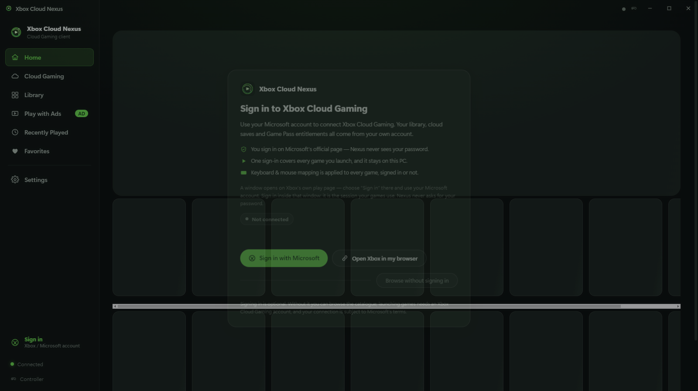
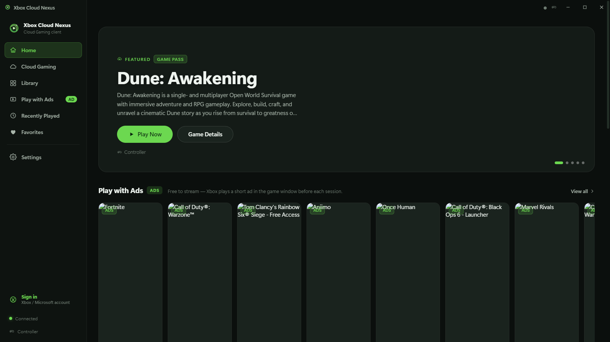
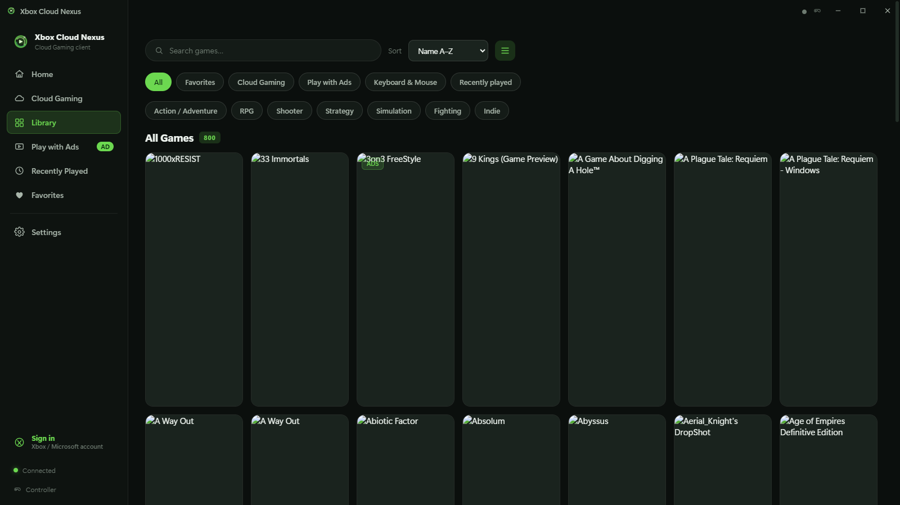
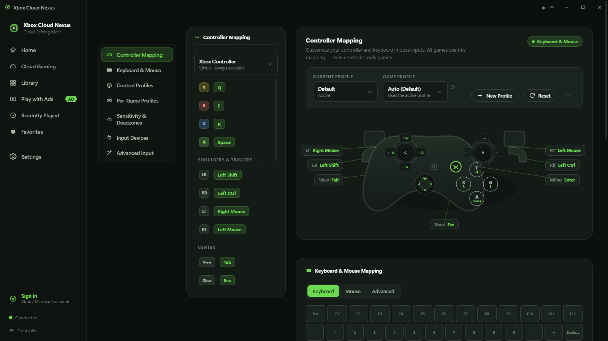
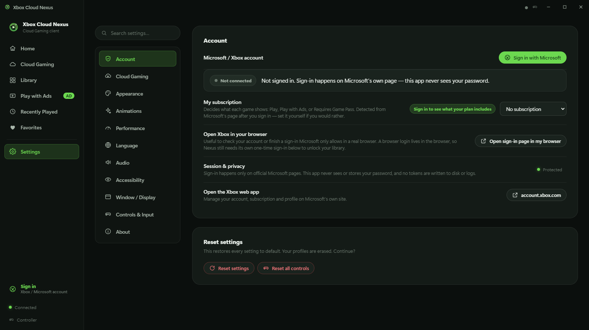

# Xbox Cloud Nexus

**A premium Windows desktop client for Xbox Cloud Gaming — and the easiest way to play
*any* cloud game with a keyboard and mouse.**

Cloud Gaming titles assume a gamepad. Xbox Cloud Nexus translates **your** keyboard and
mouse into the controller inputs a game expects, so a title that has never supported
keyboard and mouse becomes fully playable with your own bindings. Browse, search, launch
and play — with Microsoft's official sign-in and the official Cloud Gaming player, plus a
full visual remapper on top.

[](#install)
[](#build-from-source)
[](LICENSE)
[](https://github.com/redphx/better-xcloud)



<details>
<summary>More screens</summary>

| | |
| --- | --- |
|  |  |
| **Home — featured title and Play with Ads rail** | **Library — the full cloud catalogue** |
|  |  |
| **Controls & Input — mapping list, Xbox controller artwork, KBM panel, right rail** | **The same screen in a 1600x900 window** |
|  | |
| **Settings → Account — sign-in, live status, subscription tier** | |

</details>

---

## Contents

- [Highlights](#highlights)
- [Install](#install)
- [First run: signing in](#first-run-signing-in)
- [What you can play: account, region and entitlements](#what-you-can-play-account-region-and-entitlements)
- [Playing with keyboard + mouse](#playing-with-keyboard--mouse)
- [Configure Controls](#configure-controls)
- [Free games with ads](#free-games-with-ads)
- [Streaming quality, latency and low-end PCs](#streaming-quality-latency-and-low-end-pcs)
- [Architecture](#architecture)
- [Build from source](#build-from-source)
- [Testing](#testing)
- [Legal, privacy and limitations](#legal-privacy-and-limitations)
- [Credits](#credits)

---

## Highlights

**Every cloud game playable with keyboard + mouse**
Your mapping is compiled into a virtual-controller preset that Better xCloud loads before
each launch, so the game only ever sees a normal Xbox pad. Controller-only titles are the
whole point — they work exactly like the rest.

**Both input methods, live, at the same time**
Play with a real controller, with keyboard + mouse, or both. Switch per game, or press a
hotkey mid-session without leaving the stream.

**Deep, visual remapping**
A modern Xbox-style controller diagram where all 25 remappable inputs are real hotspots —
face buttons, bumpers, triggers, View/Menu/Xbox, stick clicks, D-Pad and every stick
direction. Click an input, press a key, done. The keyboard and mouse artwork highlight in
real time as you press, so you can see the translation working before you launch.

**Mouse aiming that feels right**
Mouse movement drives the right stick with per-profile sensitivity (X/Y), invert Y,
deadzone, response curve, smoothing and acceleration — the values the game actually
receives.

**Profiles, including per game**
Unlimited control profiles with per-game overrides, plus import/export and a conflict
checker that finds keys bound to more than one input.

**Built for a low-latency session**
Fullscreen play, 720p/1080p/1080p-HQ target resolution, frame-rate control, controller
polling rate, renderer choice, and a low-end mode — all applied through the official
player's own settings.

---

## Install

1. Download **`XboxCloudNexus-1.0.0-setup.exe`** (installer) or
   **`XboxCloudNexus-1.0.0-portable.exe`** (no install) from
   [Releases](../../releases).
2. Run it. Windows SmartScreen may warn about an unsigned build — choose
   *More info → Run anyway*.
3. Sign in with your Microsoft account (see below) and play.

**Requirements:** Windows 10/11 x64, a Microsoft account with Xbox Cloud Gaming access,
and an internet connection (10 Mbps+ recommended; 1080p-HQ benefits from 20 Mbps+).

---

## First run: signing in

Xbox Cloud Nexus never asks for your Microsoft password. It opens **Microsoft's own page**
inside a dedicated window that shares the same session partition your games use, so one
sign-in covers every launch:

- **Sign in with Microsoft** — opens `xbox.com/en-US/play` in an app window. Choose *Sign in*
  there and use your Microsoft account. The app watches the page and the session and
  continues automatically the moment it is connected.
- **Open Xbox in my browser** — for locked-down networks, or to check your account. A
  browser sign-in stays in the browser, so it does **not** connect Nexus; the app says so
  and keeps the one-time in-app sign-in one click away.
- **Browse without signing in** — the catalogue is browsable without an account; launching
  games needs one.

If the embedded page cannot load at all, the app opens Microsoft's page in your browser by
itself and explains why. Signing out from Settings → Account clears only the app's own Xbox
session partition — nothing else on the machine is touched.

You can sign in (or out) at any time from **Settings → Account**; it is the permanent home
of the sign-in button, the live status of the sign-in window and your subscription tier.

---

## What you can play: account, region and entitlements

The launcher never guesses. Access is computed from two things:

1. **Microsoft's own per-market catalogue data** for your region — whether a title is
   offered here at all, what it costs, and whether a subscription entitlement satisfies it.
2. **Your account's plan** — read from your signed-in Microsoft page after sign-in, or set
   once yourself in Settings → Account.

From those, every game shows one honest state:

| State | Shown when | What you can do |
| --- | --- | --- |
| **Play** | Included with your plan (or free to start) | Launch normally |
| **Play with Ads** | Xbox offers the title with a short ad pre-roll for your account and region | Launch — the ad plays in the game window first |
| **Requires Game Pass** | A subscription title your plan does not cover | Play is disabled, with the reason and Microsoft's own wording |
| **Not available** | Xbox is not offering the title in your region | Launch is disabled |

Nothing here grants access: the official Xbox page still makes the final call. The point is
that the app never shows a green *Play* for a game your account cannot start — and never
hides one it can.

---

## Playing with keyboard + mouse

1. Open **Settings → Controls & Input** (or press `Ctrl+K` and search "controls").
2. The shipped default profile already maps a familiar layout: `Space` = A, `E` = B,
   `R` = X, `Q` = Y, `Shift` = LB, `Ctrl` = RB, mouse buttons = LT/RT, `Tab` = View,
   `Esc` = Menu, `W/A/S/D` = left stick, mouse movement = right stick.
3. Click any input in the list or on the controller and press the key or mouse button you
   want. Conflicts are detected and resolved for you.
4. Tune **Mouse Settings** (sensitivity, invert Y, curve, smoothing, deadzone) — these go
   straight into the preset the game receives.
5. Launch. A pre-launch panel appears with the controls summary; press **Play now**.

**In-game hotkeys:** `F8` toggles keyboard & mouse emulation, `F9` opens the Nexus panel,
`F11` toggles fullscreen, `F12` reloads the stream.

> Pressing `Esc` twice in quick succession is Better xCloud's own "stop emulation"
> gesture, and `Esc` is the default binding for the Menu button — remap Menu if you use
> `Esc` heavily.

---

## Configure Controls

Every launch panel has a **Configure Controls** button that opens the remapper scoped to
that game, and while you are playing, the floating **Configure Controls** pill in the
stream window (`F9`) gives you the same thing without leaving the game:

- keyboard & mouse emulation on/off,
- stream resolution and frame-rate target,
- mouse sensitivity and invert Y,
- fullscreen toggle,
- apply & restart stream,
- and a jump straight to the full remapper.

---

## Free games with ads

Xbox's ad-supported catalogue streams free in exchange for a short ad the official player
plays **inside the game window** before the session starts. The app surfaces that list
(**Play with Ads**, 88 titles) marks each card, and warns you in the launch panel so the
pre-roll is never mistaken for a hang. The ad is served by Xbox inside the official
player — the app does not inject, replace or skip it.

---

## Streaming quality, latency and low-end PCs

| Setting | What it does |
| --- | --- |
| **Target resolution** | `Auto`, `720p`, `1080p` or `1080p-HQ` (4K is limited by the service, not the client). |
| **Frame rate limit** | Match display, or cap at 30/60/120 for stability on weaker hardware. |
| **Controller polling rate** | Up to 125 Hz for the lowest practical input latency. |
| **Video renderer / GPU preference** | WebGL2 or default, high-performance or integrated. |
| **Fullscreen on play** | Games open fullscreen; `F11` toggles. |
| **Low-end mode** | 720p/1080p caps, WebGL2 off, lighter UI (no blur/shadows), reduced animation, smaller artwork. |
| **Animations / UI quality** | Independent of low-end mode — motion is compositor-only, so turning it off is a real saving. |

Covers are requested at the size they are painted, loaded only as they scroll into view,
and reserved with explicit dimensions, so grids never reflow while artwork arrives.

---

## Architecture

```
src/main/          Electron main process
  main.cjs           lifecycle, security policy, IPC surface, asset protocol
  windows.cjs        launcher window, stream windows, sign-in window
  catalog.cjs        Microsoft catalogue client (lists, details, streaming fills)
  stream-bridge.cjs  profile -> Better xCloud virtual-controller preset
  store.cjs          settings with atomic writes + corruption recovery
src/preload/       preloads (launcher API + stream/hud injection)
src/renderer/      UI (vanilla ES modules, no framework)
  js/views/          home, library, details, search, settings, controls, wizard, sign-in
src/shared/        defaults shared by both processes
vendor/better-xcloud/  Better xCloud (MIT, unmodified)
scripts/           offline verification and icon generation
```

**Security posture:** the UI is served from a privileged `nexus://app/` origin with a
strict CSP; stream windows may only navigate to official `xbox.com/play` pages; IPC is
authorised by origin/session, not by caller identity; the logger scrubs anything that
looks like a token; no credentials are ever written to disk by this app.

---

## Build from source

```bash
npm install
npm start            # run the app
npm run dev          # run with debug logging
npm run dist         # build the NSIS installer + portable exe into dist/
```

Node 20+ and Windows are expected for packaging.

---

## Testing

```bash
npm run verify            # both offline suites below
npm run verify:bridge     # 57 assertions on the profile -> Better xCloud preset converter
npm run verify:entitlements  # 29 assertions on the account/access rules (real payload fixtures)
npm run uitest            # boots the real UI, tours every screen, 193 DOM assertions
npm run smoke             # launches the app, verifies catalogue, store and preset plumbing
npm run screenshots       # regenerates docs/screenshots/ from the shipping UI
```

The renderer suite drives the shipping code paths (real IPC, real windows) and covers the
controls screen layout, remapping, conflicts, live input feedback, profiles, the sign-in
gateway, account entitlements and badges, the ads flow, settings and the command palette.
The entitlement suite runs against real Microsoft payloads captured by
`node scripts/capture-entitlements.cjs`, so the access rules are proven against the same
data the app reads in production.

---

## Legal, privacy and limitations

- Sign-in happens on Microsoft's own page. This app never sees, stores or transmits your
  password.
- No DRM, authentication, region or entitlement checks are bypassed — it is a desktop
  client for the service you already pay for.
- Better xCloud is vendored unmodified under the MIT licence (see
  [`LICENSE-BETTER-XCLOUD`](LICENSE-BETTER-XCLOUD)); gamepad emulation is its feature.
- Read [`LIMITATIONS.md`](LIMITATIONS.md) before reporting bugs: what can be tested
  offline, what depends on Microsoft's endpoints, and what only a live session can prove.

---

## Credits

- [Better xCloud](https://github.com/redphx/better-xcloud) by **redphx** — the
  mouse/keyboard-to-controller emulation and stream enhancements this app builds on (MIT).
- Xbox Cloud Gaming catalogue and artwork belong to Microsoft; this project is
  unaffiliated with Microsoft.

MIT licensed — see [`LICENSE`](LICENSE).
